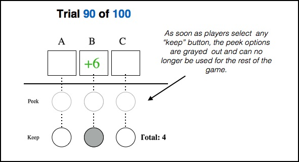
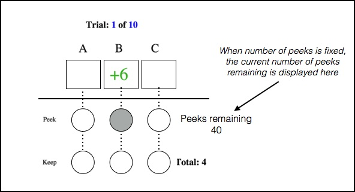
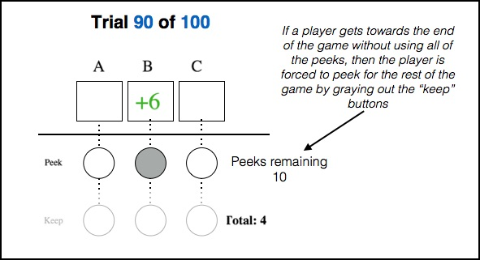

We would like to implement two administrator controlled parameters to the Peeks and Keeps Game. These parameters change how the game works

Switching to Keeps: How many times can players switch between peeking to keeping?

- *Unlimited*: Players can switch between peeking and keeping as many times as they would like (this is the original version of the game).

- *Only once*: Players can only switch from peeking to keeping *once*. In other words, as soon as a player selects a keep button, the Peeking buttons disappear (or are grayed out) and the player canonly use keeps for the rest of the game. If the player starts the game by selecting a keep button, then he/she can never peek for the entire game.
    
    
    
    
Number of Peeks: How many peeks can a player use in a game?

- *Unlimited*: Players can peek as many times as they would like to. This is the original version of the game.

- *Fixed*: Players **must** peek N times in the game, where N is an administrator parameter. For example, if the number of peeks is 10, and the total number of trials in the game is 100, then the player **must** peek 10 times in the game. In this case, there should be a counter on the screen telling the player how many peeks they have remaining in the game. The player can use their peeks any time in the game that they would like to; however, the game must force players to peek at least N times. If the player tries to end the game without using all of the peeks, the "keep" option should go away

For example, say the number of fixed peeks is 40. Then at the beginning of the game they player will see this counter:

Now, let's say a player is at trial 90 in a game where there are 100 trials. If the player has 10 peeks remaining, then he/she **must** peek for the remaining 10 trials of the game. To show this to the player, the keep buttons should be grayed out and no longer be used.

Note:

- If Switching to Keeps is "only once", and number of peeks is "fixed", then the interface will have to force the player to peek N times, and then only keep for the rest of the game. In this case, for the first N trials, the "Keep" buttons could be grayed out leaving only the "Peek" buttons. At N+1 trials, the "Keep" buttons should become available and the "Peek" buttons should be grayed out.